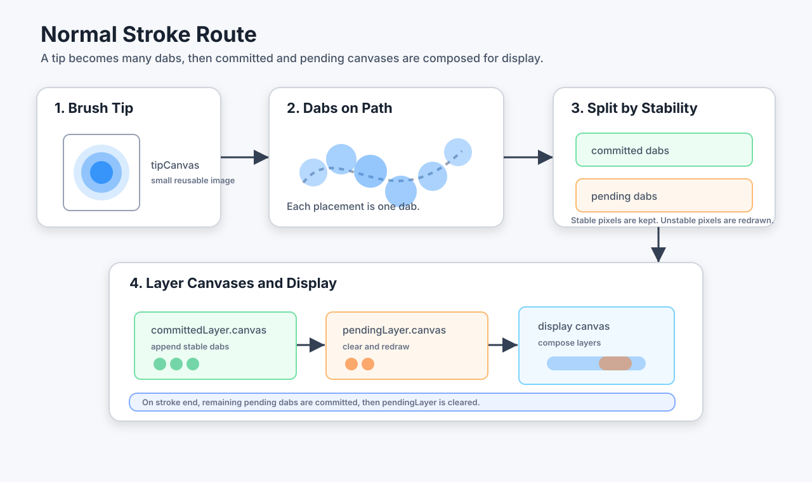
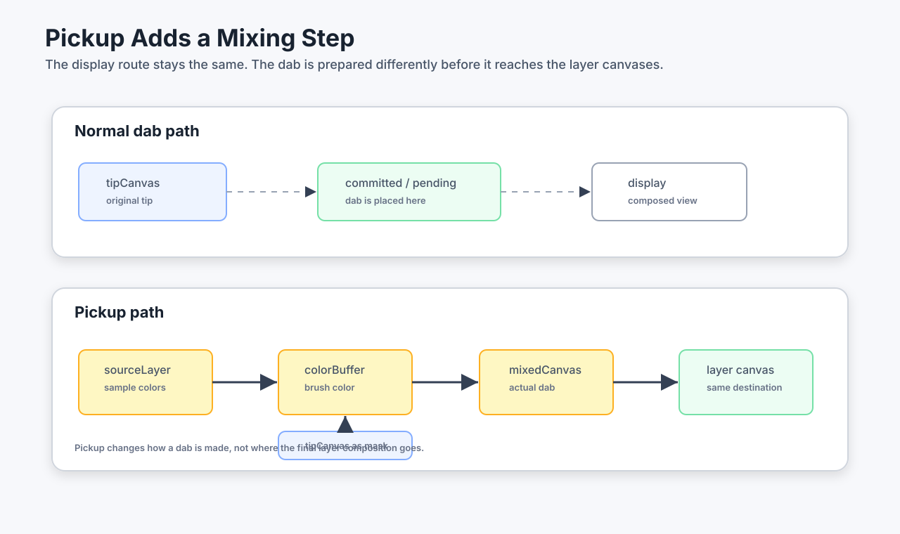
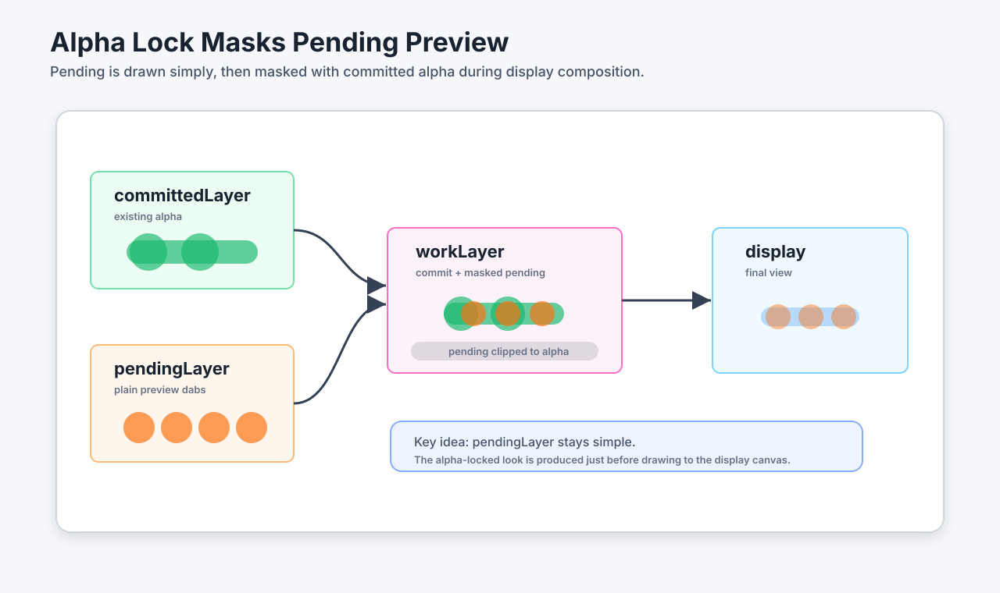

# ストロークが表示されるまで

このドキュメントは、ブラシの `tip` や `dab` が最終的な表示用 canvas に届くまでの流れを、概要として理解するための解説です。

内部実装の細かい分岐や例外を網羅する仕様書ではありません。ここでは「どの canvas が登場し、それぞれが何を担当しているか」を中心に説明します。

図の中のラベルは、短く読みやすくするため英語にしています。

## 1. まず全体像

ブラシで描いた内容は、いきなり表示用の `<canvas>` に描かれるわけではありません。

stamp ブラシでは、まず小さなブラシ先端画像である `tipCanvas` が作られます。その `tipCanvas` をストローク上に何度も置いたものが `dab` です。ユーザーには1本の線に見えますが、内部的にはたくさんの dab が重なって描画されています。

描画中のストロークは、確定済みの部分と、まだ位置が変わる可能性がある未確定の部分に分けて扱います。そのため、描画先も `committedLayer.canvas` と `pendingLayer.canvas` に分かれます。

## 2. tip と dab

`tip` はブラシ先端の形と濃さを持つ小さな画像です。円形ブラシなら円形の alpha、テクスチャブラシなら画像由来の alpha を持ちます。

`dab` は、その tip をストローク上の1地点に配置したものです。stamp ブラシでは、spacing に従って dab を並べることでストロークを表現します。

重要なのは、`tipCanvas` は「元画像」であり、実際にレイヤーに残るのは配置された dab の集合だという点です。

## 3. committed と pending

ストローク中の点は、すべてが同じ確度で扱われるわけではありません。

スムージングなどの処理により、末尾付近の点は後から位置が変わる可能性があります。これを直接 committed に描いてしまうと、修正前の位置に描いた跡を消す必要が出ます。

そこで、役割を分けます。

- `committedLayer.canvas`: 確定済みの dab を保持する。基本的に消さずに描き足す。
- `pendingLayer.canvas`: 未確定の dab を一時的に描く。毎回クリアして描き直す。

表示時には、この2つを重ねて描くため、ユーザーには自然な1本のストロークとして見えます。ストロークが終了すると、残りの pending は committed に確定され、`pendingLayer` はクリアされます。

## 4. 通常の描画ルート

pickup も alpha lock もない場合、流れは単純です。

1. `tipCanvas` を作る。
2. ストローク上に dab を配置する。
3. 確定した dab は `committedLayer.canvas` に描く。
4. 未確定の dab は `pendingLayer.canvas` に描く。
5. 表示用 canvas には、レイヤー群と pending overlay を合成して描く。

このルートでは、dab を作る工程と、表示用 canvas に合成する工程が素直につながっています。

## 5. pickup がある場合

pickup は「ブラシが下にある色を少し拾う」ための仕組みです。

通常ルートでは `tipCanvas` がそのまま dab の元になります。pickup ありでは、`tipCanvas` を直接置く前に、ブラシが持っている色を更新する工程が入ります。

追加で登場する主な canvas は次の3つです。

- `sourceLayer.canvas`: ストローク開始時点の committed をコピーした参照元。
- `colorBuffer`: ブラシが現在持っている色を保持する小さな buffer。
- `mixedCanvas`: `colorBuffer` に `tipCanvas` の alpha をかけた、実際に配置される dab。

pickup で変わるのは、主に「dab を作る前段」です。最終的に描き込まれる先は、通常ルートと同じく `committedLayer.canvas` または `pendingLayer.canvas` です。

## 6. alpha lock がある場合

alpha lock は「すでに alpha がある場所にだけ色を乗せる」ための仕組みです。

確定描画では、`committedLayer.canvas` に描く時点で既存 alpha の範囲に制限されます。一方で `pendingLayer.canvas` は、未確定部分を単純に描き直すための作業場所なので、pending 自体は通常通り描かれます。

そのまま pending を表示すると、透明部分にも preview が見えてしまいます。そこで表示用 canvas に出す前に、`workLayer.canvas` で committed と pending を先に合成します。

alpha lock ありの live preview では、`workLayer.canvas` が「見た目を整えるための一時的な合成先」として登場します。

## 7. 覚えておくとよいこと

- `tipCanvas` は dab の元画像。
- `dab` は tip をストローク上に1回置いたもの。
- `committedLayer.canvas` は確定済みの描画を保持する。
- `pendingLayer.canvas` は未確定部分の一時プレビュー。
- pickup は、dab を作る前に色を混ぜる工程を追加する。
- alpha lock は、pending preview を表示する直前に committed の alpha で制限する。
- ユーザーが見ているのは、これらの canvas を合成した表示用 canvas。

